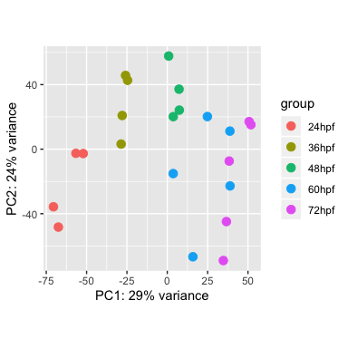

Differential expression analysis (DESeq2) - replicate plus time point
================
Chelsea Herdman
February 13th, 2020

We performed differential expression analysis using DESeq2 on the
imported bias corrected transcript abundances produced by kallisto and
tximport following the DESeq2 vignette found
[here](http://bioconductor.org/packages/release/bioc/vignettes/DESeq2/inst/doc/DESeq2.html).

### Set up the counts matrix for DESeq

Load required libraries.

``` r
library(data.table)
library(DESeq2)
library(here)
library(biomaRt)
library(apeglm)
library(RColorBrewer)
library(pheatmap)
library(fs)
```

Load sample info table and make column data dataframe.

``` r
sample_info = fread(here("DESeq2", "ribozero_sample_info.txt"))
cData = data.frame(time_point=factor(sample_info$time_point,
                                     levels=c("24hpf", "36hpf", "48hpf",
                                              "60hpf", "72hpf")),
                   replicate_id=factor(sample_info$replicate_id,
                                       levels=paste("rep_", 1:5, sep="")))
rownames(cData) = sample_info$gnomex_id
```

Load counts table.

If we used the original counts plus offset method, we would run the
following. \> dds = DESeqDataSetFromTximport(txi.kallisto.offset, cData,
\~ time\_point)

``` r
counts_tab = fread(here("Tximport", "20200204_ribozero_counts_fromtximport_biascorrected.txt.gz"))
```

    ## Registered S3 method overwritten by 'R.oo':
    ##   method        from       
    ##   throw.default R.methodsS3

``` r
counts = as.matrix(counts_tab[, !"ensembl_gene_id"])
rownames(counts) = counts_tab$ensembl_gene_id
storage.mode(counts) = "integer" # DESeq requires us to change numeric values to integer.
```

-----

### Diagnostics

***Read sum distributions***

``` r
summary(rowSums(counts))
```

    ##     Min.  1st Qu.   Median     Mean  3rd Qu.     Max. 
    ##        0      483     4451    38257    24438 57254448

``` r
dim(counts)
```

    ## [1] 37227    22

``` r
sum(rowSums(counts) == 0)
```

    ## [1] 718

``` r
sum(rowSums(counts) < 10)
```

    ## [1] 1477

``` r
hist(log10(rowSums(counts) + 1), breaks=100, col="grey80")
abline(v=log10(1e6), col="red")
abline(v=log10(10), col="red")
```

<!-- -->

``` r
# Remove genes with fewer than 10 and more than 1e6 reads total (over 22 samples)
# (removes 1665 genes)
counts = counts[rowSums(counts) > 10, ]
counts = counts[rowSums(counts) < 1e6, ]

summary(rowSums(counts))
```

    ##    Min. 1st Qu.  Median    Mean 3rd Qu.    Max. 
    ##      11     644    5144   27883   25762  982962

``` r
dim(counts)
```

    ## [1] 35562    22

-----

### Run Differential Expression Analysis

***Create the DESeqDataSet***

Perform the likelihood ratio test and create a datatable of the
differential expression results.

``` r
dds = DESeqDataSetFromMatrix(countData=counts,
                             colData=cData,
                             design=~ replicate_id + 
                                      time_point)

dds = estimateSizeFactors(dds)
dds = estimateDispersions(dds)
```

    ## gene-wise dispersion estimates

    ## mean-dispersion relationship

    ## final dispersion estimates

``` r
dds = nbinomLRT(dds, reduced=~ replicate_id)
```

    ## 1 rows did not converge in beta, labelled in mcols(object)$fullBetaConv. Use larger maxit argument with nbinomLRT

``` r
res = results(dds, cooksCutoff=TRUE)

plotMA(res, ylim = c(-3, 3))
```

<!-- -->

``` r
plotDispEsts(dds)
```

<!-- -->

``` r
res = as.data.frame(res)
res = data.frame(ensembl_gene_id=rownames(res), res)
res = data.table(res)
setorder(res, pvalue, na.last=TRUE)
length(unique(res$ensembl_gene_id))
```

    ## [1] 35562

``` r
sum(res$padj < 0.05, na.rm=TRUE )
```

    ## [1] 10557

``` r
sum(is.na(res$pvalue))
```

    ## [1] 0

``` r
hist(res$pvalue, breaks=20, col="grey" )
```

<!-- -->

``` r
res05 = results(dds, alpha=0.05)
summary(res05)
```

    ## 
    ## out of 35562 with nonzero total read count
    ## adjusted p-value < 0.05
    ## LFC > 0 (up)       : 5875, 17%
    ## LFC < 0 (down)     : 4729, 13%
    ## outliers [1]       : 0, 0%
    ## low counts [2]     : 3448, 9.7%
    ## (mean count < 5)
    ## [1] see 'cooksCutoff' argument of ?results
    ## [2] see 'independentFiltering' argument of ?results

``` r
resultsNames(dds)
```

    ## [1] "Intercept"                   "replicate_id_rep_2_vs_rep_1"
    ## [3] "replicate_id_rep_3_vs_rep_1" "replicate_id_rep_4_vs_rep_1"
    ## [5] "replicate_id_rep_5_vs_rep_1" "time_point_36hpf_vs_24hpf"  
    ## [7] "time_point_48hpf_vs_24hpf"   "time_point_60hpf_vs_24hpf"  
    ## [9] "time_point_72hpf_vs_24hpf"

``` r
resLFC = lfcShrink(dds, coef="time_point_72hpf_vs_24hpf", type="apeglm")
```

    ## using 'apeglm' for LFC shrinkage. If used in published research, please cite:
    ##     Zhu, A., Ibrahim, J.G., Love, M.I. (2018) Heavy-tailed prior distributions for
    ##     sequence count data: removing the noise and preserving large differences.
    ##     Bioinformatics. https://doi.org/10.1093/bioinformatics/bty895

``` r
plotMA(resLFC, ylim=c(-2,2))
```

<!-- -->

***Compute Normalized Counts***

Convert matrix of normalized counts into data.table, with a gene\_id
column in order to incorporate into differential expression results
table.

``` r
norm_counts = counts(dds, normalized=TRUE)
norm_tab = data.table(norm_counts)
norm_tab$ensembl_gene_id = rownames(norm_counts)
```

Convert from wide-form to long-form and compute mean normalized counts.

``` r
norm = melt(norm_tab, id.vars="ensembl_gene_id", value.name="norm_counts",
            variable.name="gnomex_id", variable.factor=FALSE)

norm = merge(x=norm, y=sample_info[, list(gnomex_id, time_point,
                                          replicate_id)], by="gnomex_id")

summary_norm = norm[,
              list(mean_normcounts=mean(norm_counts)),
                    by=list(ensembl_gene_id,
                            time_point)]
```

Convert summary table of mean normalized counts to wide-form and merge
into differential expression results.

``` r
sum_norm = dcast(summary_norm, ensembl_gene_id ~ time_point,
                 value.var="mean_normcounts")

setcolorder(sum_norm, c("ensembl_gene_id", "24hpf", "36hpf", "48hpf",
                        "72hpf"))

res_sum = merge(res, sum_norm, by = "ensembl_gene_id")

setorder(res_sum, pvalue, na.last=TRUE)
```

***rlog transformation***

Perform rlog transformation, taking into account different variability
of samples. Extract the computed rlog values into a matrix, then convert
to long form.

``` r
rld <- rlog(dds, blind=FALSE)
rmat = assay(rld)
rtab = data.table(rmat)
rtab$ensembl_gene_id = rownames(rmat)

rlog_long = melt(rtab, id.vars="ensembl_gene_id",
                 variable.name="gnomex_id", value.name="rlog_value")

rlog_long = merge(rlog_long, 
                  sample_info[, list(gnomex_id, rep_time, 
                                     replicate_id, time_point)],
                  by="gnomex_id")
```

Perform principal component analysis on the rlog values.

``` r
plotPCA(rld, intgroup=c("time_point"), ntop=10000)
```

<!-- -->

``` r
vsd <- vst(dds, blind=FALSE)
sampleDists <- dist(t(assay(vsd)))
sampleDistMatrix <- as.matrix(sampleDists)
rownames(sampleDistMatrix) <- paste(vsd$condition, vsd$type, sep="-")
colnames(sampleDistMatrix) <- paste(vsd$replicate_id, vsd$time_point, sep="-")
colors <- colorRampPalette( rev(brewer.pal(9, "Blues")) )(255)
pheatmap(sampleDistMatrix,
         clustering_distance_rows=sampleDists,
         clustering_distance_cols=sampleDists,
         col=colors)
```

<!-- -->

-----

### Create complete annotated results table

Fetch annotations from biomaRt using permanent link for GRCz11 - release
99. Merge in gene annotations to DESeq results table

``` r
annot_g = fread(here("DESeq2", "gene_annot_biomart_z11_r99.txt.gz"))

res_sum = merge(res_sum, annot_g, by="ensembl_gene_id")

setorder(res_sum, padj, na.last = TRUE)
# Save these after figuring out the tpms 
#fwrite(rlog_long, here("DESeq2", "20200213_deseq2_rlog_results.txt.gz"))
#fwrite(res_sum, here("DESeq2", "20200213_deseq2_results.txt.gz"))

genes_to_keep_fdr = res_sum[padj < 0.05, ensembl_gene_id]

fdr_tab = rlog_long[ensembl_gene_id %in% genes_to_keep_fdr]

length(unique(fdr_tab$ensembl_gene_id))
```

    ## [1] 10557

Create input files for running DPGP clustering. Four files containing
rlog values for each replicate.

``` r
# Loop to build and save to file table of rlog values for each replicate.
# By looping over c("rep_1", "rep_2", "rep_3", "rep_4"),
# we leave out/ignore the incomplete replicate 5 values.

dir_create(here("DESeq2", "dpgp_input_files"))

for (rep_i in c("rep_1", "rep_2", "rep_3", "rep_4")) {
    tmp_tab = fdr_tab[replicate_id == rep_i]
    tmp_wide = dcast(data=tmp_tab, formula=ensembl_gene_id ~ time_point,
                     value.var="rlog_value")
    setnames(tmp_wide, c("gene", "24", "36", "48", "60", "72"))
    tmp_filename = paste("DPGPCluster_rlog_", rep_i, "_fdr5pct_",
                         length(genes_to_keep_fdr),"genes_20200214.txt", sep="")
    fwrite(tmp_wide, file=here("DESeq2", "dpgp_input_files", tmp_filename), sep="\t")
}
```
