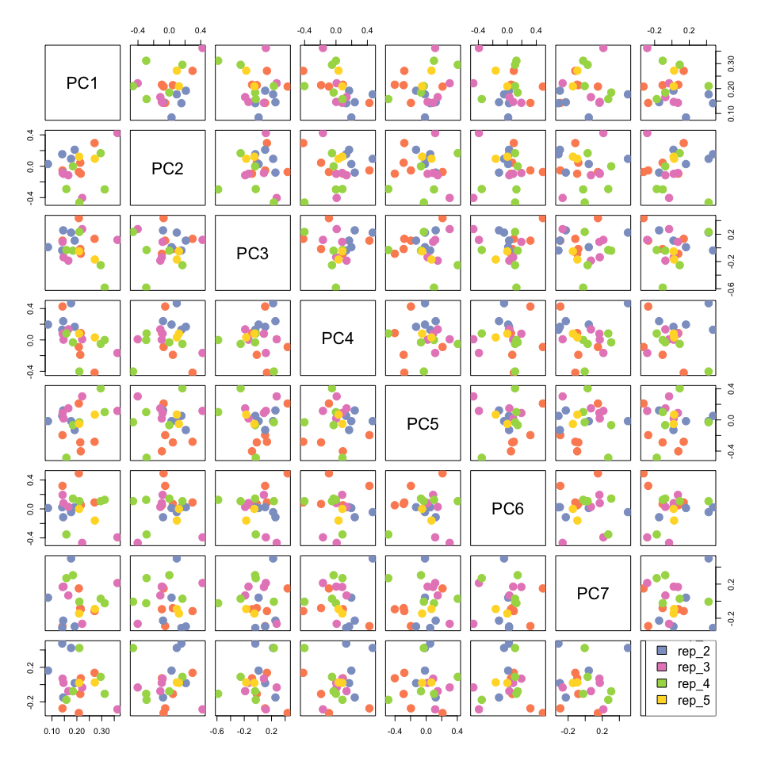
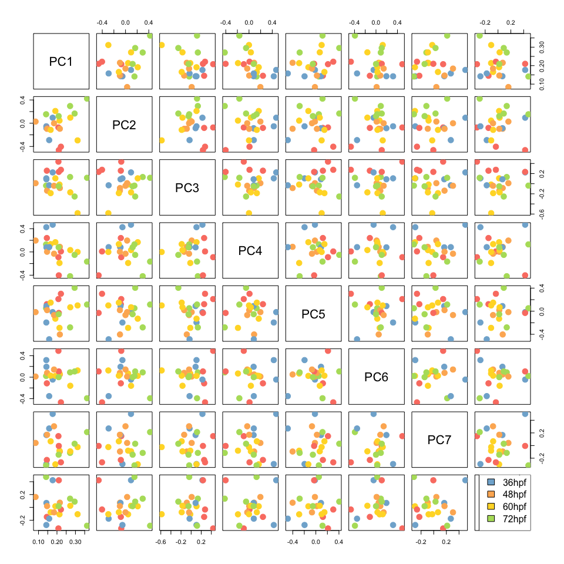

Differential Expression Analysis (DESeq2)
================
Chelsea Herdman
05/Feb/2020

In order to perform differential expression analysis using DESeq2 on the
imported bias corrected transcript abundances produced by kallisto and
tx import, we followed the DESeq2 vignette found
[here](http://bioconductor.org/packages/release/bioc/vignettes/DESeq2/inst/doc/DESeq2.html).

#### Set up the DESeqDataSet

Load required libraries.

``` r
library(data.table)
library(DESeq2)
library(here)
```

Load sample info table and make column data dataframe

``` r
sample_info = fread(here("DESeq2", "ribozero_sample_info.txt"))

cData = data.frame(time_point=factor(sample_info$time_point,
                                     levels=c("24hpf", "36hpf", "48hpf", "60hpf",
                                              "72hpf")),
                   replicate_id=factor(sample_info$rep_id,
                                       levels=paste("rep_", 1:5, sep="")))

rownames(cData) = sample_info$gnomex_id
```

Load counts table.

> If we had used the original counts plus offset method, we could run
> the following.

> dds \<- DESeqDataSetFromTximport(txi.kallisto.offset, cData,
> ~time\_point)

``` r
counts_tab = fread(here("Tximport", "20200204_ribozero_counts_fromtximport_biascorrected.txt"))
counts = as.matrix(counts_tab[, !"ensembl_gene_id"])
rownames(counts) = counts_tab$ensembl_gene_id
```

DESeq requires us to change numeric values to integer.

``` r
storage.mode(counts) = "integer"
```

-----

Diagnostic pca plots of the raw counts to determine whether to add
replicate to the model.

``` r
pcres = prcomp(counts)

pctab = data.table(pcres$rotation[, 1:8])
pctab[, sample_id:=rownames(pcres$rotation)]
pctab[, time_point:=sample_info$time_point]
pctab[, replicate_id:=sample_info$rep_id]

rep_colors = c(rep_1="#fc8d62",
               rep_2="#8da0cb",
               rep_3="#e78ac3",
               rep_4="#a6d854",
               rep_5="#ffd92f")

time_colors = c("24hpf"="#fb8072",
                "36hpf"="#80b1d3",
                "48hpf"="#fdb462",
                "60hpf"="#ffd92f",
                "72hpf"="#b3de69")

#pdf(here("DESeq2", "figs", "20200205_pca_plots_rawcounts.pdf"), 
#         width=10, height=10)
```

``` r
pairs(pcres$rotation[, 1:8], cex=3, pch=20, col=rep_colors[pctab$replicate_id])
legend(x="bottomright", legend=names(rep_colors), fill=rep_colors)
```

<!-- -->

``` r
pairs(pcres$rotation[, 1:8], cex=3, pch=20, col=time_colors[pctab$time_point])
legend(x="bottomright", legend=names(time_colors), fill=time_colors)
```

<!-- -->

``` r
#dev.off()

#pdf(here("DESeq2", "DiagnosticFigs", "20200205_screeplot_pca_rawcounts.pdf"), 
#    width=6, height=4)
```

``` r
screeplot(pcres)
```

<!-- -->

``` r
#dev.off()
```

Conclusion: 24hpf and 36 hpf samples cluster well by time\_point
(e.g. PC2 vs PC3). Conclusion: Samples generally do not cluster by
replicate\_id. PC1 accounts for all of variance, and does not correlate
with time\_point or replicate.

-----

``` r
dds_rplust = DESeqDataSetFromMatrix(countData=counts,
                             colData=cData,
                             design=~ replicate_id + time_point)

dds_rplust = estimateSizeFactors(dds_rplust)
dds_rplust = estimateDispersions(dds_rplust)
```

    ## gene-wise dispersion estimates

    ## mean-dispersion relationship

    ## final dispersion estimates

``` r
dds_rplust = nbinomLRT(dds_rplust, reduced=~ replicate_id)

res_rplust = results(dds_rplust, cooksCutoff=FALSE)


res_rplust = as.data.frame(res_rplust)
res_rplust = data.frame(ensembl_gene_id=rownames(res_rplust), res_rplust)
res_rplust = data.table(res_rplust)

setorder(res_rplust, pvalue, na.last=TRUE)


norm_counts = counts(dds_rplust, normalized=TRUE)

norm_tab = data.table(norm_counts)
norm_tab$ensembl_gene_id = rownames(norm_counts)


pcres_norm = prcomp(norm_counts)

pctab_norm = data.table(pcres_norm$rotation[, 1:8])
pctab_norm[, sample_id:=rownames(pcres_norm$rotation)]
pctab_norm[, time_point:=sample_info$time_point]
pctab_norm[, replicate_id:=sample_info$rep_id]


#pdf(here("DESeq2", "figs", "20200205_pca_plots_normcounts.pdf"), 
#    width=10, height=10)
rep_colors = c(rep_1="#fc8d62",
               rep_2="#8da0cb",
               rep_3="#e78ac3",
               rep_4="#a6d854",
               rep_5="#ffd92f")

pairs(pcres_norm$rotation[, 1:8], cex=3, pch=20, col=rep_colors[pctab_norm$replicate_id])
legend(x="bottomright", legend=names(rep_colors), fill=rep_colors)
```

<!-- -->

``` r
time_colors = c("24hpf"="#fb8072",
                "36hpf"="#80b1d3",
                "48hpf"="#fdb462",
                "60hpf"="#ffd92f",
                "72hpf"="#b3de69")

pairs(pcres_norm$rotation[, 1:8], cex=3, pch=20, col=time_colors[pctab_norm$time_point])
legend(x="bottomright", legend=names(time_colors), fill=time_colors)
```

<!-- -->

``` r
#dev.off()

#pdf(here("DESeq2", "figs", "20200205_screeplot_pca_normcounts.pdf"), 
#    width=6, height=4)
screeplot(pcres_norm)
```

<!-- -->

``` r
#dev.off()


# Perform rlog transformation, 
# taking into account different variability of samples
rld <- rlog(dds_rplust, blind=FALSE)

# Extract computed rlog values into a matrix
rmat = assay(rld)
rtab = data.table(rmat)
rtab$ensembl_gene_id = rownames(rmat)


pcres_rlog = prcomp(rmat)

pctab_rlog = data.table(pcres_rlog$rotation[, 1:8])
pctab_rlog[, sample_id:=rownames(pcres_rlog$rotation)]
pctab_rlog[, time_point:=sample_info$time_point]
pctab_rlog[, replicate_id:=sample_info$rep_id]


#pdf(here("DESeq2", "figs", "20200205_pca_plots_rlogcounts.pdf"), 
#    width=10, height=10)
rep_colors = c(rep_1="#fc8d62",
               rep_2="#8da0cb",
               rep_3="#e78ac3",
               rep_4="#a6d854",
               rep_5="#ffd92f")

pairs(pcres_rlog$rotation[, 1:8], cex=3, pch=20, col=rep_colors[pctab_rlog$replicate_id])
legend(x="bottomright", legend=names(rep_colors), fill=rep_colors)
```

<!-- -->

``` r
time_colors = c("24hpf"="#fb8072",
                "36hpf"="#80b1d3",
                "48hpf"="#fdb462",
                "60hpf"="#ffd92f",
                "72hpf"="#b3de69")

pairs(pcres_rlog$rotation[, 1:8], cex=3, pch=20, col=time_colors[pctab_rlog$time_point])
legend(x="bottomright", legend=names(time_colors), fill=time_colors)
```

<!-- -->

``` r
#dev.off()

#pdf(here("DESeq2", "figs", "20200205_screeplot_pca_rlogcounts.pdf"), 
#    width=6, height=4)
screeplot(pcres_rlog)
```

<!-- -->

``` r
#dev.off()

# run deseq2 just timepoint...
# rlog pca with blind=TRUE
# rlog pca with blind=false for each model
# plot dotplots of genes with centered rlogs by timepoint, coloured by replicate
# brad is looking at scatterplots of pc1 vs size factors and reads sum per sample
# brad looking at bugs in tximport
# lfcshrink?
# remove low counts?
# cookscutoff = TRUE
# false was so that all genes showed up in shiny app
# model diagnostics folder
```
