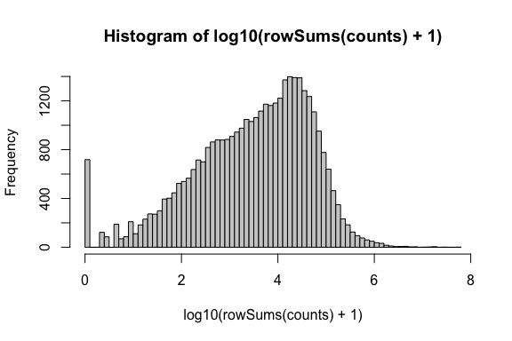
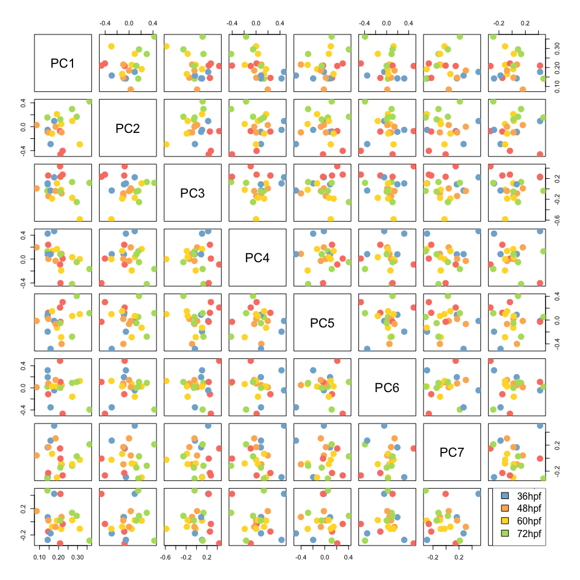

Differential expression analysis (DESeq2)
================
Chelsea Herdman
February 5th, 2020

We performed differential expression analysis using DESeq2 on the
imported bias corrected transcript abundances produced by kallisto and
tximport following the DESeq2 vignette found
[here](http://bioconductor.org/packages/release/bioc/vignettes/DESeq2/inst/doc/DESeq2.html).

#### Set up the DESeqDataSet

Load required libraries.

``` r
library(data.table)
library(DESeq2)
library(here)
```

Load sample info table and make column data dataframe.

``` r
sample_info = fread(here("DESeq2", "ribozero_sample_info.txt"))
cData = data.frame(time_point=factor(sample_info$time_point,
                                     levels=c("24hpf", "36hpf", "48hpf",
                                              "60hpf", "72hpf")),
                   replicate_id=factor(sample_info$rep_id,
                                       levels=paste("rep_", 1:5, sep="")))
rownames(cData) = sample_info$gnomex_id
```

Load counts table.

If we used the original counts plus offset method, we would run the
following. \> dds = DESeqDataSetFromTximport(txi.kallisto.offset, cData,
~
time\_point)

``` r
counts_tab = fread(here("Tximport", "20200204_ribozero_counts_fromtximport_biascorrected.gz"))
counts = as.matrix(counts_tab[, !"ensembl_gene_id"])
rownames(counts) = counts_tab$ensembl_gene_id
storage.mode(counts) = "integer" # DESeq requires us to change numeric values to integer.
```

-----

### Diagnostics

***Read sum
distributions***

``` r
hist(log10(rowSums(counts) + 1), breaks=100, col="grey80")
```

<!-- -->

``` r
summary(rowSums(counts))
```

    ##     Min.  1st Qu.   Median     Mean  3rd Qu.     Max. 
    ##        0      483     4451    38257    24438 57254448

``` r
dim(counts)
```

    ## [1] 37227    22

``` r
sum(rowSums(counts) == 0)
```

    ## [1] 718

``` r
sum(rowSums(counts) < 10)
```

    ## [1] 1477

***PCA plots of raw counts***

``` r
pcres = prcomp(counts)
pctab = data.table(pcres$rotation[, 1:8])
pctab[, sample_id:=rownames(pcres$rotation)]
pctab[, time_point:=sample_info$time_point]
pctab[, replicate_id:=sample_info$rep_id]

rep_colors = c(rep_1="#fc8d62",
               rep_2="#8da0cb",
               rep_3="#e78ac3",
               rep_4="#a6d854",
               rep_5="#ffd92f")

time_colors = c("24hpf"="#fb8072",
                "36hpf"="#80b1d3",
                "48hpf"="#fdb462",
                "60hpf"="#ffd92f",
                "72hpf"="#b3de69")

#pdf(here("DESeq2", "model_diagnostics", "replicate_plus_timepoint", "figs" "20200205_pca_plots_rawcounts.pdf"), width=10, height=10)

pairs(pcres$rotation[, 1:8], cex=3, pch=20, col=rep_colors[pctab$replicate_id])
legend(x="bottomright", legend=names(rep_colors), fill=rep_colors)
```

<!-- -->

``` r
pairs(pcres$rotation[, 1:8], cex=3, pch=20, col=time_colors[pctab$time_point])
legend(x="bottomright", legend=names(time_colors), fill=time_colors)
```

<!-- -->

``` r
# dev.off()
```
