Differential expression analysis (DESeq2) - time point model
================
Chelsea Herdman
February 5th, 2020

We performed differential expression analysis using DESeq2 on the
imported bias corrected transcript abundances produced by kallisto and
tximport following the DESeq2 vignette found
[here](http://bioconductor.org/packages/release/bioc/vignettes/DESeq2/inst/doc/DESeq2.html).

### Set up the counts matrix for DESeq

Load required libraries.

``` r
library(data.table)
library(DESeq2)
library(here)
library(biomaRt)
library(apeglm)
library(RColorBrewer)
library(pheatmap)
```

Load sample info table and make column data dataframe.

``` r
sample_info = fread(here("DESeq2", "ribozero_sample_info.txt"))
cData = data.frame(time_point=factor(sample_info$time_point,
                                     levels=c("24hpf", "36hpf", "48hpf",
                                              "60hpf", "72hpf")),
                   replicate_id=factor(sample_info$rep_id,
                                       levels=paste("rep_", 1:5, sep="")))
rownames(cData) = sample_info$gnomex_id
```

Load counts table.

If we used the original counts plus offset method, we would run the
following. \> dds = DESeqDataSetFromTximport(txi.kallisto.offset, cData,
~
time\_point)

``` r
counts_tab = fread(here("Tximport", "20200204_ribozero_counts_fromtximport_biascorrected.txt.gz"))
counts = as.matrix(counts_tab[, !"ensembl_gene_id"])
rownames(counts) = counts_tab$ensembl_gene_id
storage.mode(counts) = "integer" # DESeq requires us to change numeric values to integer.
```

-----

### Diagnostics

***Read sum distributions***

``` r
hist(log10(rowSums(counts) + 1), breaks=100, col="grey80")
```

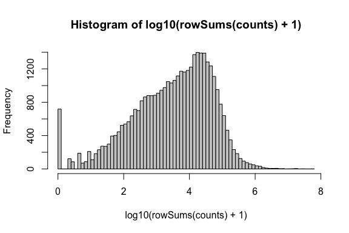<!-- -->

``` r
summary(rowSums(counts))
```

    ##     Min.  1st Qu.   Median     Mean  3rd Qu.     Max. 
    ##        0      483     4451    38257    24438 57254448

``` r
dim(counts)
```

    ## [1] 37227    22

``` r
sum(rowSums(counts) == 0)
```

    ## [1] 718

``` r
sum(rowSums(counts) < 10)
```

    ## [1] 1477

***PCA plots of raw counts***

``` r
pcres = prcomp(counts)
pctab = data.table(pcres$rotation[, 1:8])
pctab[, sample_id:=rownames(pcres$rotation)]
pctab[, time_point:=sample_info$time_point]
pctab[, replicate_id:=sample_info$rep_id]

rep_colors = c(rep_1="#fc8d62",
               rep_2="#8da0cb",
               rep_3="#e78ac3",
               rep_4="#a6d854",
               rep_5="#ffd92f")

time_colors = c("24hpf"="#fb8072",
                "36hpf"="#80b1d3",
                "48hpf"="#fdb462",
                "60hpf"="#ffd92f",
                "72hpf"="#b3de69")

#pdf(here("DESeq2", "model_diagnostics", "replicate_plus_timepoint", "figs", "20200205_pca_plots_rawcounts.pdf"), #width=10, height=10)
pairs(pcres$rotation[, 1:8], cex=3, pch=20, col=rep_colors[pctab$replicate_id])
legend(x="bottomright", legend=names(rep_colors), fill=rep_colors)
```

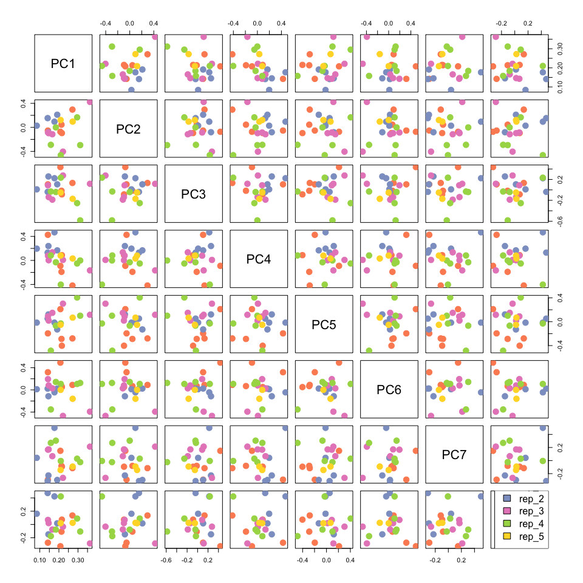<!-- -->

``` r
pairs(pcres$rotation[, 1:8], cex=3, pch=20, col=time_colors[pctab$time_point])
legend(x="bottomright", legend=names(time_colors), fill=time_colors)
```

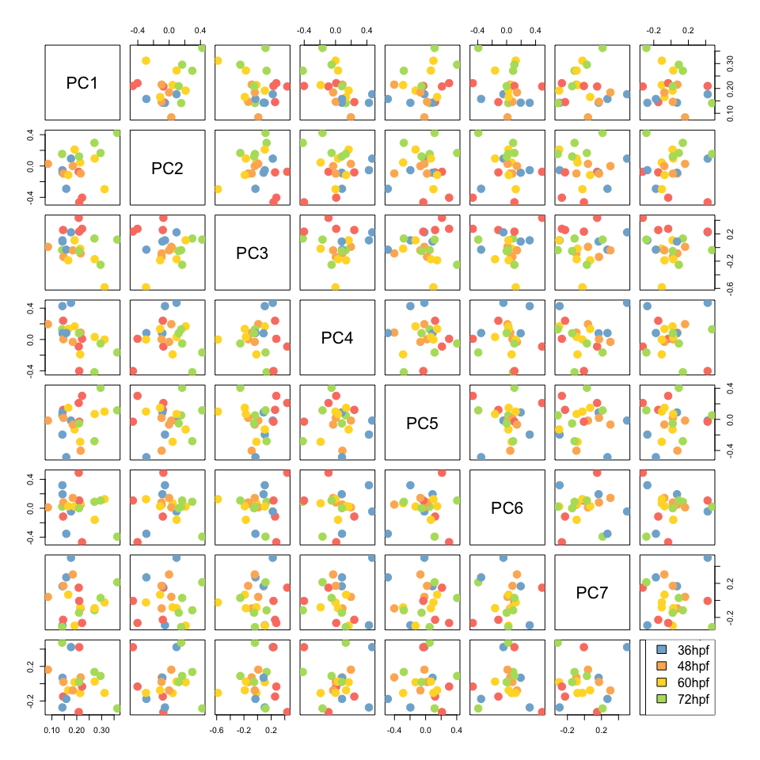<!-- -->

``` r
#dev.off()

screeplot(pcres)
```

<!-- -->

Conclusions: 24hpf and 36 hpf samples cluster well by time\_point
(e.g. PC2 vs PC3). Samples generally do not cluster by replicate\_id.
PC1 accounts for all of variance, and does not correlate with
time\_point or replicate.

-----

### Run Differential Expression Analysis

***Create the DESeqDataSet***

Perform the likelihood ratio test and create a datatable of the
differential expression results.

``` r
dds = DESeqDataSetFromMatrix(countData=counts,
                             colData=cData,
                             design=~ time_point)
# May prefilter.
#keep <- rowSums(counts(dds)) >= 10
#dds <- dds[keep,]

dds = estimateSizeFactors(dds)
dds = estimateDispersions(dds)
```

    ## gene-wise dispersion estimates

    ## mean-dispersion relationship

    ## final dispersion estimates

``` r
dds = nbinomLRT(dds, reduced=~ 1)
res = results(dds, cooksCutoff=TRUE)

plotMA(res, ylim = c(-3, 3))
```

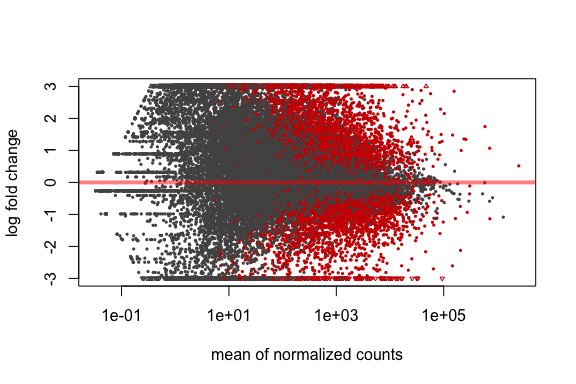<!-- -->

``` r
plotDispEsts(dds)
```

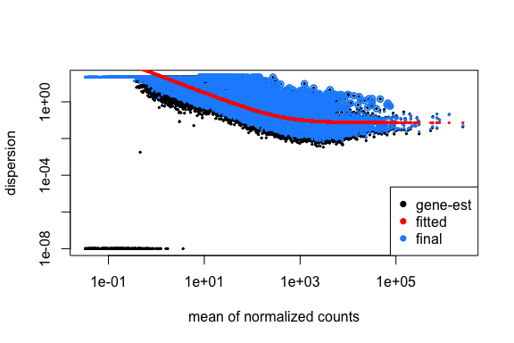<!-- -->

``` r
res = as.data.frame(res)
res = data.frame(ensembl_gene_id=rownames(res), res)
res = data.table(res)
setorder(res, pvalue, na.last=TRUE)
length(unique(res$ensembl_gene_id))
```

    ## [1] 37227

``` r
sum(res$padj < 0.05, na.rm=TRUE )
```

    ## [1] 8437

``` r
sum(is.na(res$pvalue))
```

    ## [1] 947

``` r
hist(res$pvalue, breaks=20, col="grey" )
```

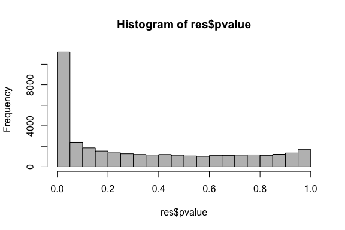<!-- -->

``` r
res05 = results(dds, alpha=0.05)
summary(res05)
```

    ## 
    ## out of 36509 with nonzero total read count
    ## adjusted p-value < 0.05
    ## LFC > 0 (up)       : 4502, 12%
    ## LFC < 0 (down)     : 3935, 11%
    ## outliers [1]       : 229, 0.63%
    ## low counts [2]     : 4120, 11%
    ## (mean count < 5)
    ## [1] see 'cooksCutoff' argument of ?results
    ## [2] see 'independentFiltering' argument of ?results

``` r
resultsNames(dds)
```

    ## [1] "Intercept"                 "time_point_36hpf_vs_24hpf"
    ## [3] "time_point_48hpf_vs_24hpf" "time_point_60hpf_vs_24hpf"
    ## [5] "time_point_72hpf_vs_24hpf"

``` r
resLFC = lfcShrink(dds, coef="time_point_72hpf_vs_24hpf", type="apeglm")
```

    ## using 'apeglm' for LFC shrinkage. If used in published research, please cite:
    ##     Zhu, A., Ibrahim, J.G., Love, M.I. (2018) Heavy-tailed prior distributions for
    ##     sequence count data: removing the noise and preserving large differences.
    ##     Bioinformatics. https://doi.org/10.1093/bioinformatics/bty895

``` r
plotMA(resLFC, ylim=c(-2,2))
```

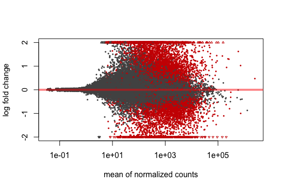<!-- -->

***Compute Normalized Counts***

Convert matrix of normalized counts into data.table, with a gene\_id
column in order to incorporate into differential expression results
table.

``` r
norm_counts = counts(dds, normalized=TRUE)
norm_tab = data.table(norm_counts)
norm_tab$ensembl_gene_id = rownames(norm_counts)
```

Convert from wide-form to long-form and compute mean normalized counts.

``` r
#norm = melt(norm_tab, id.vars="ensembl_gene_id",
#            value.name="norm_counts",
#            variable.name="sample_id",
#            variable.factor=FALSE)
#norm = merge(x=norm, y=sample_info[, list(sample_id,
#                                        time_point,
#                                        replicate_id)],
#             by="sample_id")
#summary_norm = norm[,
#              list(mean_normcounts=mean(norm_counts)),
#                    by=list(ensembl_gene_id,
#                            time_point)]
```

Convert summary table of mean normalized counts to wide-form and merge
into differential expression
results.

``` r
#sum_norm = dcast(summary_norm, ensembl_gene_id ~ time_point, value.var="mean_normcounts")
#setcolorder(sum_norm, c("ensembl_gene_id", "24hpf", "36hpf", "48hpf", "72hpf"))
#res_sum = merge(res, sum_norm, by = "ensembl_gene_id")
#setorder(res_sum, pvalue, na.last=TRUE)
```

Run principal components analysis on the normalized counts.

``` r
pcres_norm = prcomp(norm_counts)
pctab_norm = data.table(pcres_norm$rotation[, 1:8])
pctab_norm[, sample_id:=rownames(pcres_norm$rotation)]
pctab_norm[, time_point:=sample_info$time_point]
pctab_norm[, replicate_id:=sample_info$rep_id]

#pdf(here("DESeq2", "model_diagnostics", "replicate_plus_timepoint", "figs", "20200205_pca_plots_normcounts.pdf"), #width=10, height=10)
pairs(pcres_norm$rotation[, 1:8], cex=3, pch=20, col=rep_colors[pctab_norm$replicate_id])
legend(x="bottomright", legend=names(rep_colors), fill=rep_colors)
```

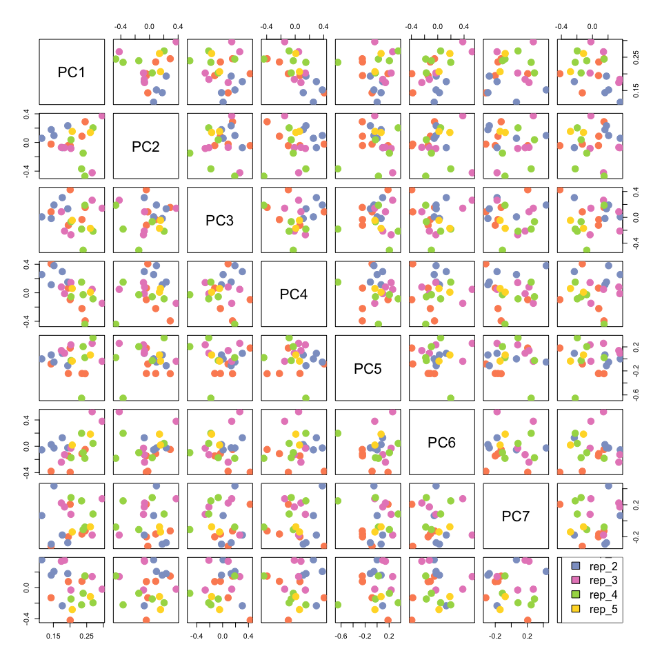<!-- -->

``` r
pairs(pcres_norm$rotation[, 1:8], cex=3, pch=20, col=time_colors[pctab_norm$time_point])
legend(x="bottomright", legend=names(time_colors), fill=time_colors)
```

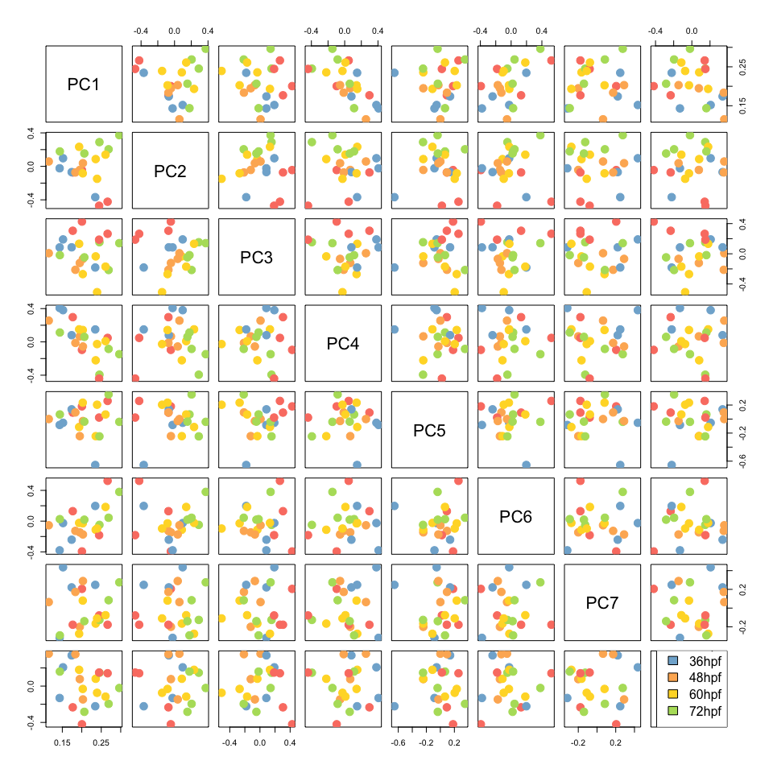<!-- -->

``` r
#dev.off()

screeplot(pcres_norm)
```

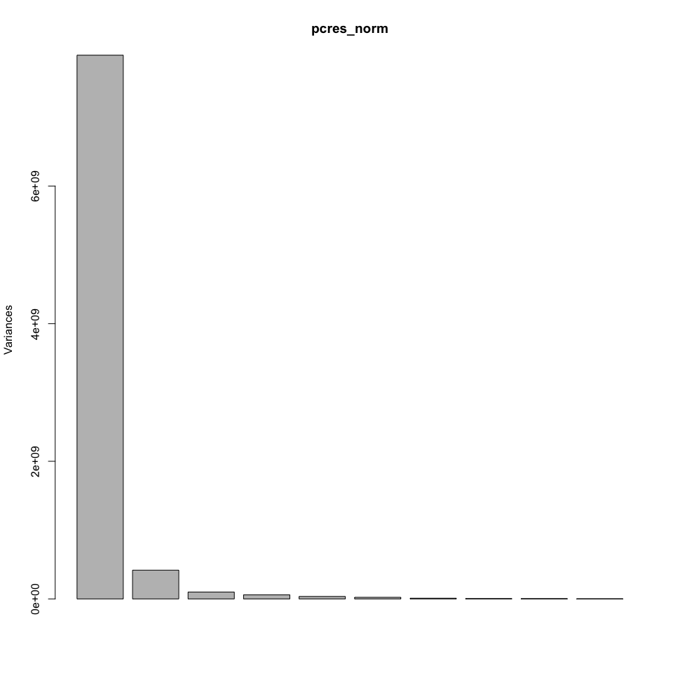<!-- -->

***rlog transformation***

Perform rlog transformation, taking into account different variability
of samples. Extract the computed rlog values into a matrix, then convert
to long form.

``` r
rld <- rlog(dds, blind=FALSE)
rmat = assay(rld)
rtab = data.table(rmat)
rtab$ensembl_gene_id = rownames(rmat)

rlog_long = melt(rtab, id.vars="ensembl_gene_id",
                 variable.name="sample_id", value.name="rlog_value")
```

Perform principal component analysis on the rlog values.

``` r
pcres_rlog = prcomp(rmat)
pctab_rlog = data.table(pcres_rlog$rotation[, 1:8])
pctab_rlog[, sample_id:=rownames(pcres_rlog$rotation)]
pctab_rlog[, time_point:=sample_info$time_point]
pctab_rlog[, replicate_id:=sample_info$rep_id]

#pdf(here("DESeq2", "model_diagnostics", "replicate_plus_timepoint", "figs", "20200205_pca_plots_rlogcounts.pdf"), width=10, height=10)
pairs(pcres_rlog$rotation[, 1:8], cex=3, pch=20, col=rep_colors[pctab_rlog$replicate_id])
legend(x="bottomright", legend=names(rep_colors), fill=rep_colors)
```

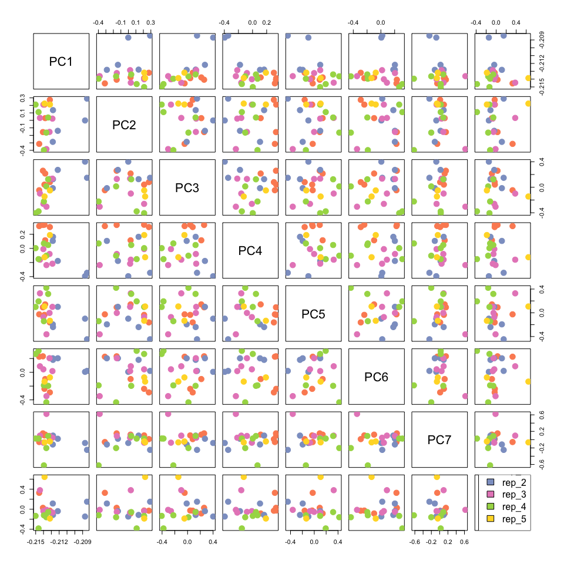<!-- -->

``` r
pairs(pcres_rlog$rotation[, 1:8], cex=3, pch=20, col=time_colors[pctab_rlog$time_point])
legend(x="bottomright", legend=names(time_colors), fill=time_colors)
```

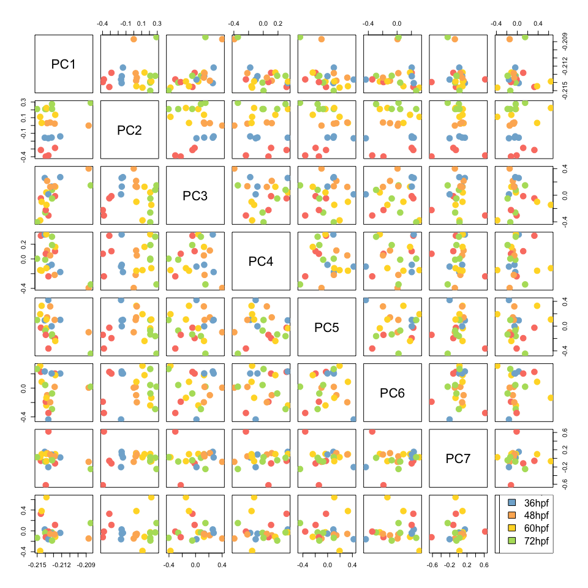<!-- -->

``` r
#dev.off()

screeplot(pcres_rlog)
```

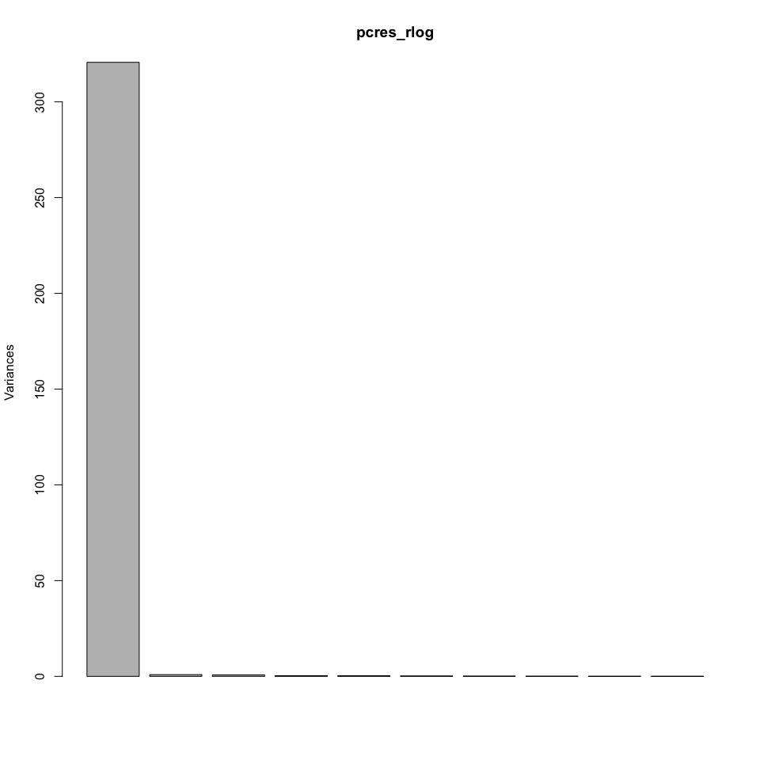<!-- -->

``` r
plotPCA(rld, intgroup=c("time_point"))
```

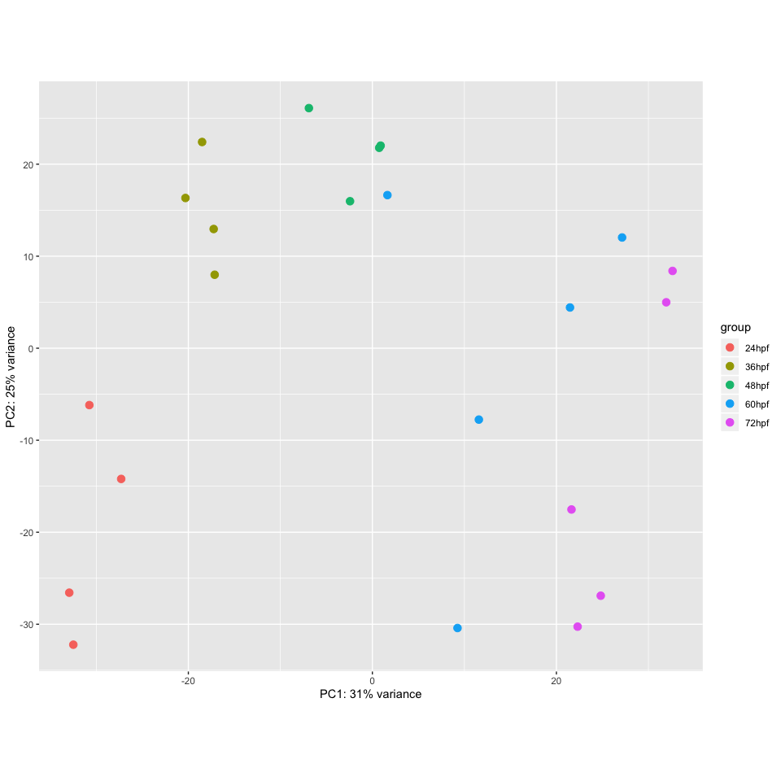<!-- -->

``` r
plotPCA(rld, intgroup=c("replicate_id"))
```

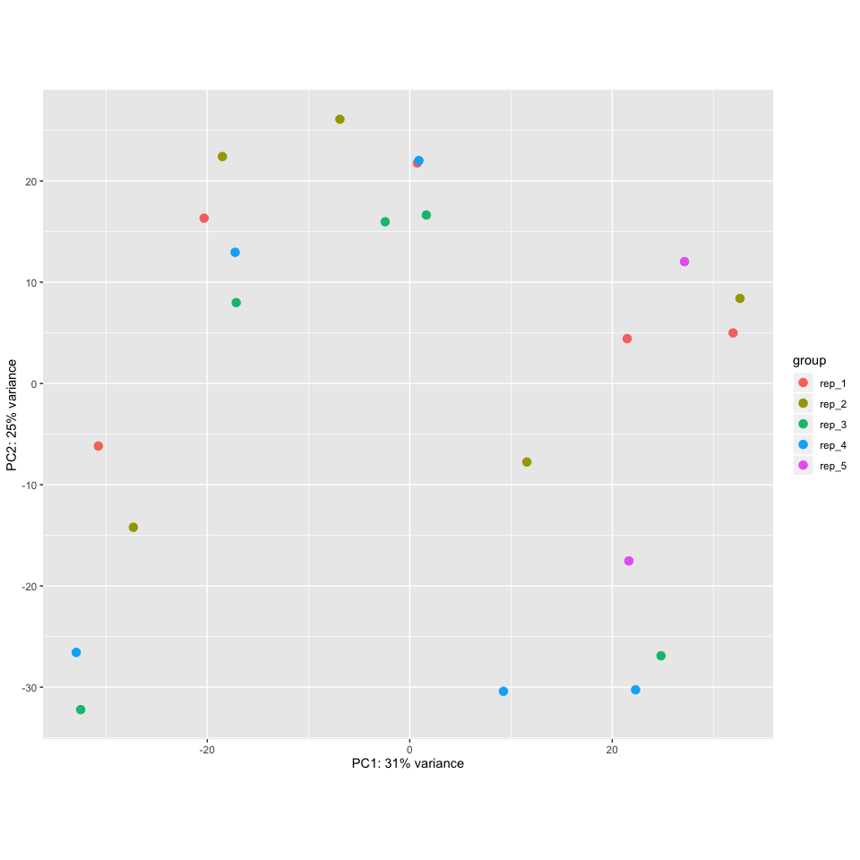<!-- -->

``` r
#plotPCA(rld, intgroup=c("qc_conc"))
```

``` r
vsd <- vst(dds, blind=FALSE)
sampleDists <- dist(t(assay(vsd)))
sampleDistMatrix <- as.matrix(sampleDists)
rownames(sampleDistMatrix) <- paste(vsd$condition, vsd$type, sep="-")
colnames(sampleDistMatrix) <- paste(vsd$replicate_id, vsd$time_point, sep="-")
colors <- colorRampPalette( rev(brewer.pal(9, "Blues")) )(255)
pheatmap(sampleDistMatrix,
         clustering_distance_rows=sampleDists,
         clustering_distance_cols=sampleDists,
         col=colors)
```

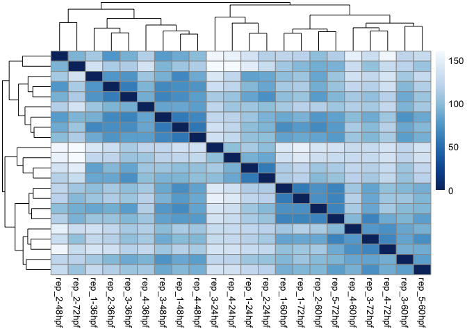<!-- -->

-----

### Create complete annotated results table

Fetch annotations from biomaRt using permanent link for GRCz11 - release
99. Merge in gene annotations to DESeq results table

``` r
#mart = useMart(biomart="ENSEMBL_MART_ENSEMBL",
#               dataset="drerio_gene_ensembl",
#               host="jan2020.archive.ensembl.org")
#
#annot_g = as.data.table(getBM(mart=mart,
#                              attributes=c("ensembl_gene_id",
#                                           "external_gene_name",
#                                           "chromosome_name",
#                                           "gene_biotype")))
#
#data_tab = merge(res_sum, annot_g, by="ensembl_gene_id")
```
